# Fraud Block
🇫🇷 [Version française](README_FR.md)
## Introduction
The Fraud Block project is an open source security tool for e-retailers. Its aim is to assist in identifying abnormal transactions for an e-commerce platform. It fills the gap of lacking free tools that can be made available to everyone to protect themselves from fraudulent transactions, solely using non-sensitive information.

The application is compatible with Android, iOS, Windows, and MacOS. Due to funding constraints, it is currently only available for public access on [Android](#android) and [Windows](#windows) platforms.

This project was initiated as part of the master projects at ESME Paris, a French engineering school. The authors are *Illan Assuied*, *[Nikita Guery](https://github.com/gostravel)*, *Paul-Henri Lamarque*, and *[Eyal Wekstein](https://github.com/WeksteinEyal)*.
## Index
- [Getting Started](#getting-started) : To quickly understand how to use the tool.
- [Usage documentation](#usage-documentation) : To get all the details.
- [Download links](#download) : To download the app.
## Getting Started
One can use the [Fraud detector](#fraud-detector) after filling and sending its e-commerce informations from the [Profile](#profile) tab. These pieces of information are utilized to construct an AI model tailored to the user's e-commerce needs, capable of detecting any abnormal transactions. Data is not stored, and the model is saved on the user's device. This step requires an internet connection. Subsequently, the user can utilize the fraud detector without internet by inputting information from a suspicious transaction.

A [chatbot](#chatbot) is available to accompany the user during the application's usage, as well as to provide them with information on the topic of frauds.

From the [Services](#services) tab, the user can also verify if an email is listed on one or more sites affected by a data leak. Also it is possible to report an user or to check how many times an user has been reported.

## Usage documentation
### Profile
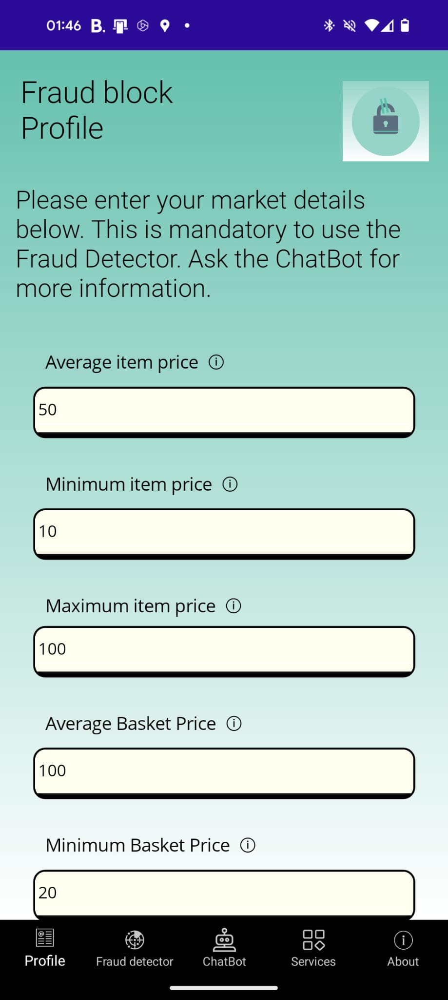 

The entry point of the fraud detector. Here, the user enters their e-commerce information to subsequently create a fraud detection model tailored to their market. This step is necessary to use the fraud detector and requires an internet connection.

Here is an exhaustive list of all the required fields. All values are numericals and can be integers or decimals.
|Field|Description|
|---|---|
|Average item price|The average price for all the different items for sale|
|Minimum item price|The least expensive item for sale|
|Maximum item price|The most expensive item for sale|
|Average basket price|The average basket price from all the different sells made|
|Minimum basket price|The least expensive basket sold|
|Maximum basket price|The most expensive basket sold|
|Average basket quantity|The average quantity of items per basket from all the different sells made|
|Minimum basket quantity|The smallest quantity of items sold|
|Maximum basket quantity|The biggest quantity of items sold|
|Growth rate %|The e-commerce growth rate in % (yearly)|

### Fraud detector

After submitting their market profile, the user can fill in the following fields to check whether a transaction is potentially fraudulent or not. Doesn't require an internet connection.
|Field|Description|
|---|---|
|Minimum item price|The least expensive item in the customer's basket|
|Maximum item price|The most expensive item in the customer's basket|
|Quantity in basket|The amount of items in the customer's basket|
|Total basket price|The total amount paid by the customer for this basket|

### ChatBot
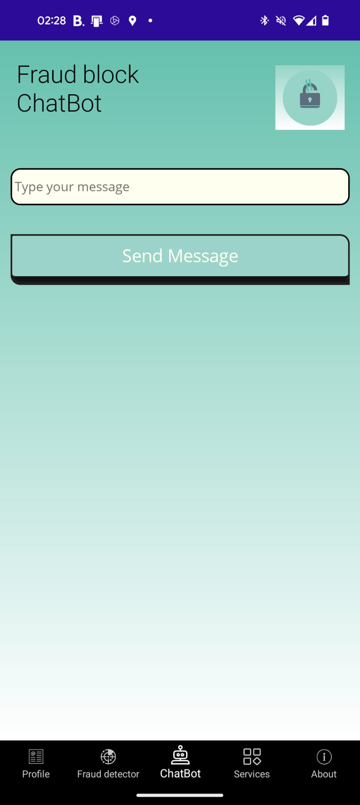

The ChatBot has been trained to answer questions about the app and on the topic of frauds. It only works in English and is not a generative chatbot (such as ChatGPT). It means that you can submit a question without worrying about the reliability of the response. All answers have been drafted and approved by the team. The ChatBot requires an internet connection.

### Services
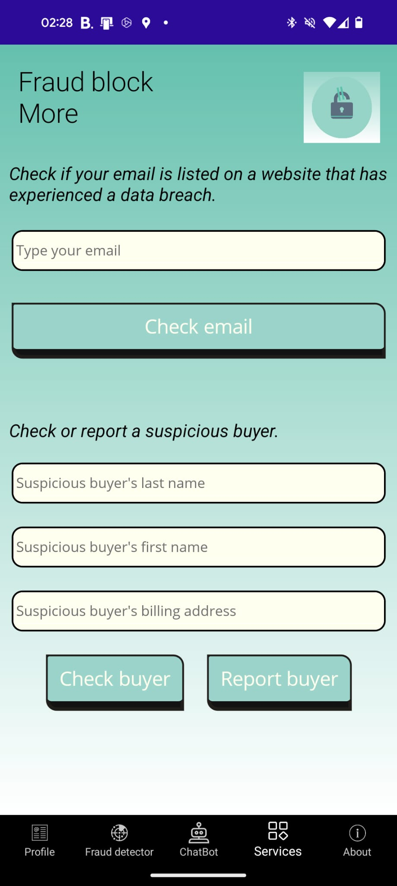

The services are additional tools to verify if a customer is suspicious. It is a good practice to use them if a potential fraud has been detected.
#### Email checker
This tool is used to verify if an email is listed on a website that has experienced a data breach. The user can then view all relevant sites, the date of the data breach, the number of leaked data, and a description of the incident. It requires an internet connection and is powered by [whatismyipaddress](https://whatismyipaddress.com/).

#### Report system
This collaborative report system purpose is to report and check suspicious customers, using the billing address informations (name, forename, address).

## Download
Unfortunately, despite having an IOS and MacOS compatibility and since we didn't upload on any store, the app currently cannot be used on IOS and MacOS.
### Android
[download link](https://github.com/WeksteinEyal/detection_fraude/releases/download/Android/fraud_block_1.0.11.0.apk)
### Windows
[download link](https://drive.google.com/uc?export=download&id=1joEPXb3MOEKN5G9aDT22bvMbUvYnoYfL)

To install Fraud Block on your windows machine :

1) Right click on the downloaded zip file **Fraud_Block_1.0.x.x.zip**

2) Click on "Extract all..."
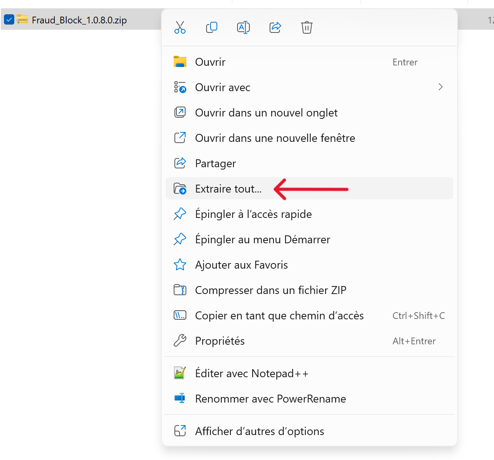

3) You can choose a destination folder for the installation directory or leave it as the original. Click on "Extract."
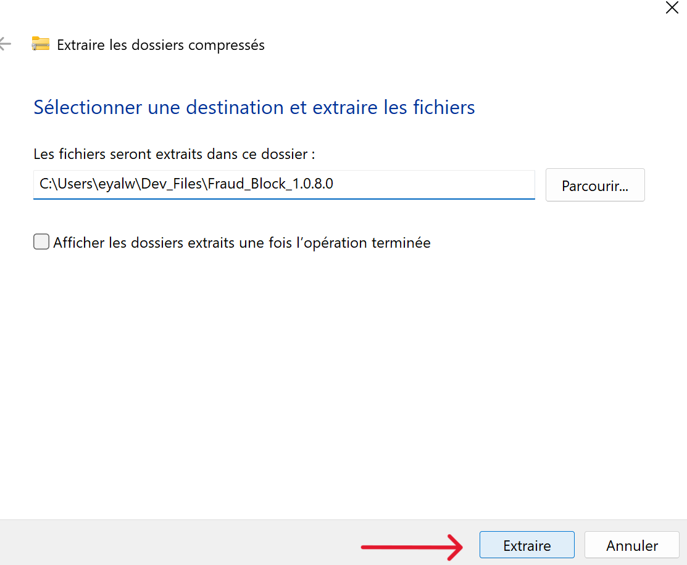

4) Open the folder **Fraud_Block_1.0.x.x**
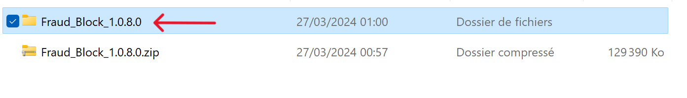

5) Open the security certificate **Fraud_Block_1.0.x.x_x64.cer**.

6) Click on "Install Certificate...".

7) Select "Local Machine" and then click "Next".

8) Select "Place all certificates in the following store" and then click "Browse..."

9) Select "Trusted People" and then click "OK".
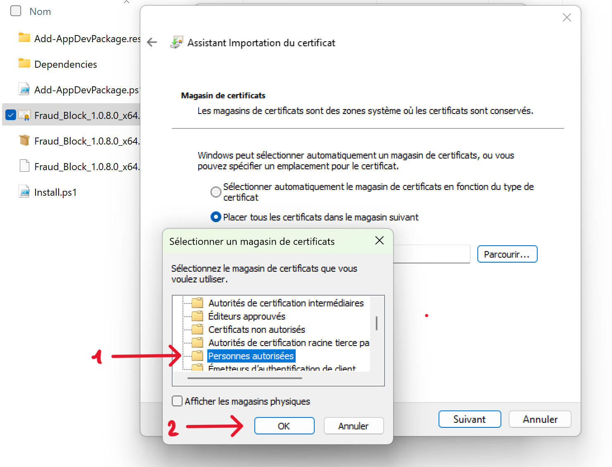

10) Click on "Next".
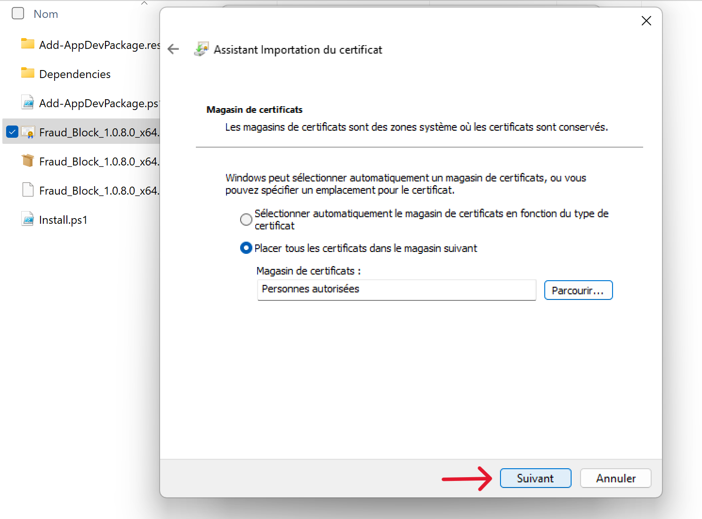

11) Click on "Finish".
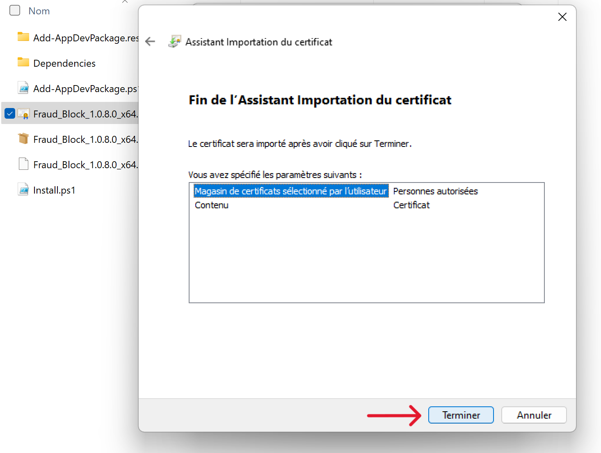

12) Click "OK" and then "OK" again.
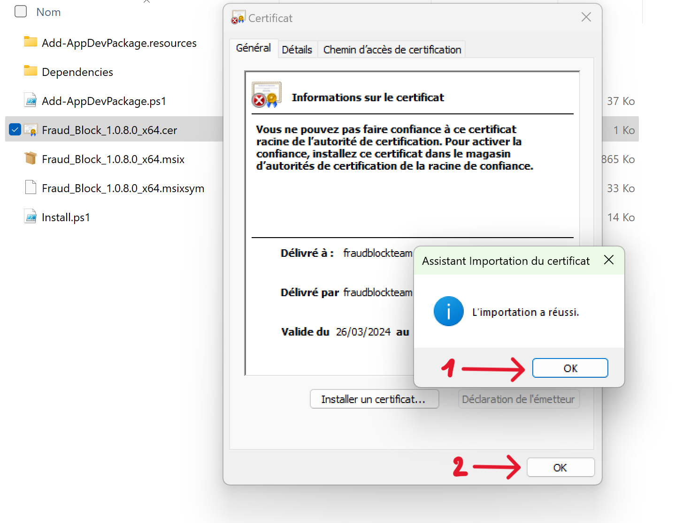

13) Open the file **Fraud_Block_1.0.x.x_x64.msix**.

14) Click on "Install".

15) You can now access the application by typing "Fraud Block" in the Windows search.

16) Fill out your profile and test any transactions that seem abnormal to you.
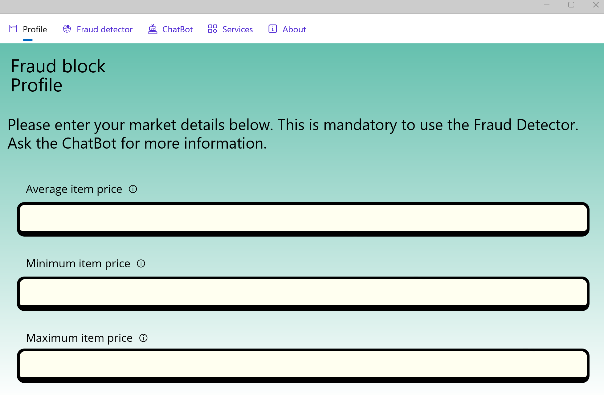

